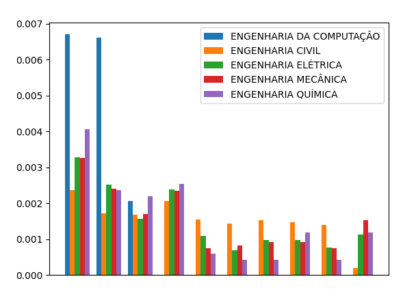
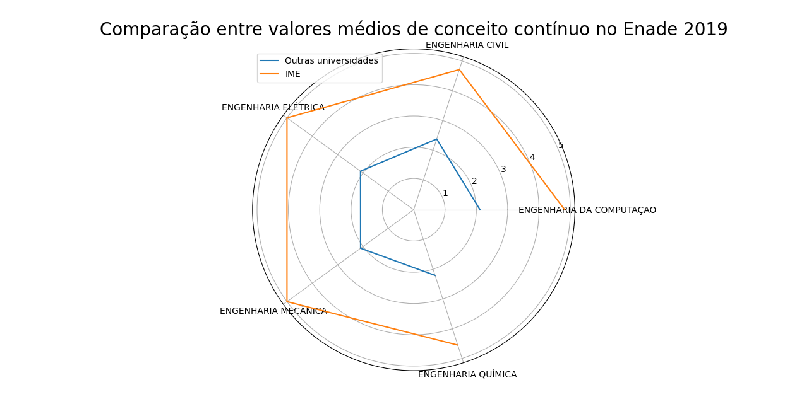

# Estatísticas - Output

Conceitos IME:

{'ENGENHARIA DA COMPUTAÇÃO': 4.8197, 'ENGENHARIA CIVIL': 4.713, 'ENGENHARIA ELÉTRICA': 5.0, 'ENGENHARIA MECÂNICA': 5.0, 'ENGENHARIA QUÍMICA': 4.5517}

Estatísticas Outras Universidades

{'ENGENHARIA DA COMPUTAÇÃO': {'Media': 2.117306944444445, 'Variancia': 0.9537383057851078, 'Desvio Padrao': 0.9765952620124203, 'Moda': 2.6678, 'Mediana': 1.9779499999999999}, 'ENGENHARIA CIVIL': {'Media': 2.3779241803278692, 'Variancia': 0.8066550454399024, 'Desvio Padrao': 0.8981397694345253, 'Moda': 1.9694, 'Mediana': 2.197}, 'ENGENHARIA ELÉTRICA': {'Media': 2.099329830508473, 'Variancia': 0.6996945053474288, 'Desvio Padrao': 0.8364774386362306, 'Moda': 1.1591, 'Mediana': 1.9012}, 'ENGENHARIA MECÂNICA': {'Media': 2.096042796610169, 'Variancia': 0.8116369923633656, 'Desvio Padrao': 0.9009089811758819, 'Moda': 1.8944, 'Mediana': 1.91515}, 'ENGENHARIA QUÍMICA': {'Media': 2.2070444444444424, 'Variancia': 1.0998797273057375, 'Desvio Padrao': 1.0487515088455117, 'Moda': 3.1199, 'Mediana': 2.1476}}

# Histograma
 
# Starplot
 